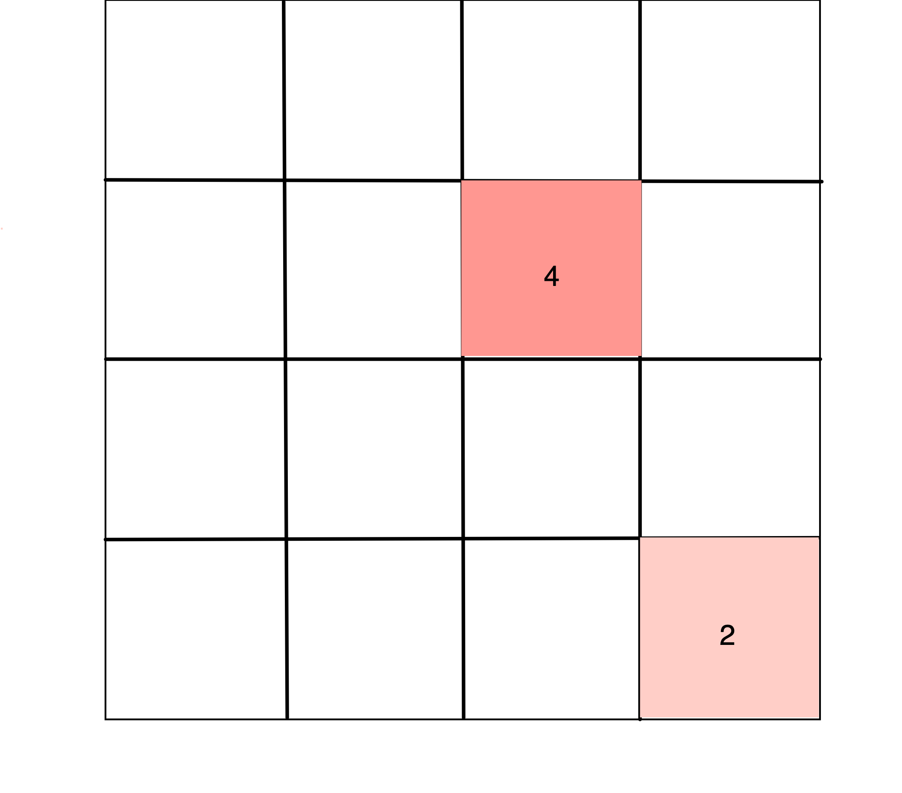
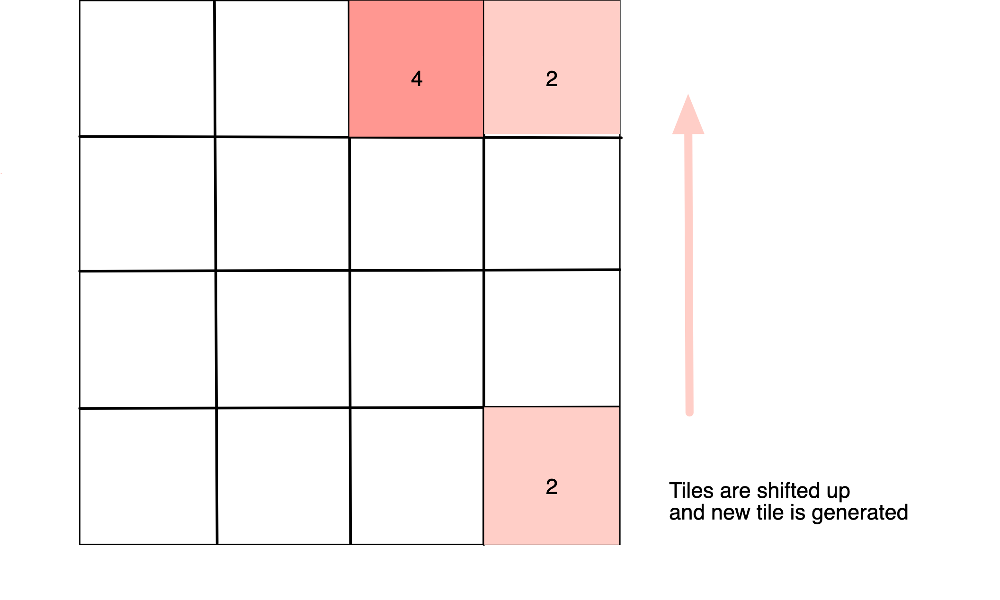
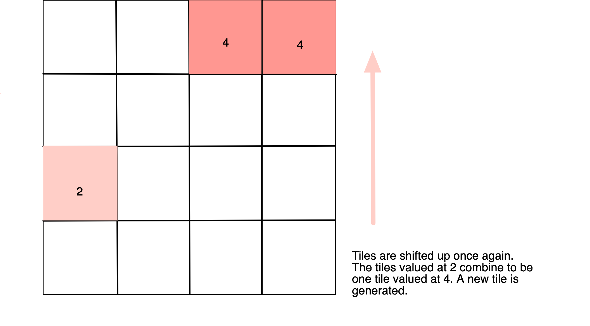
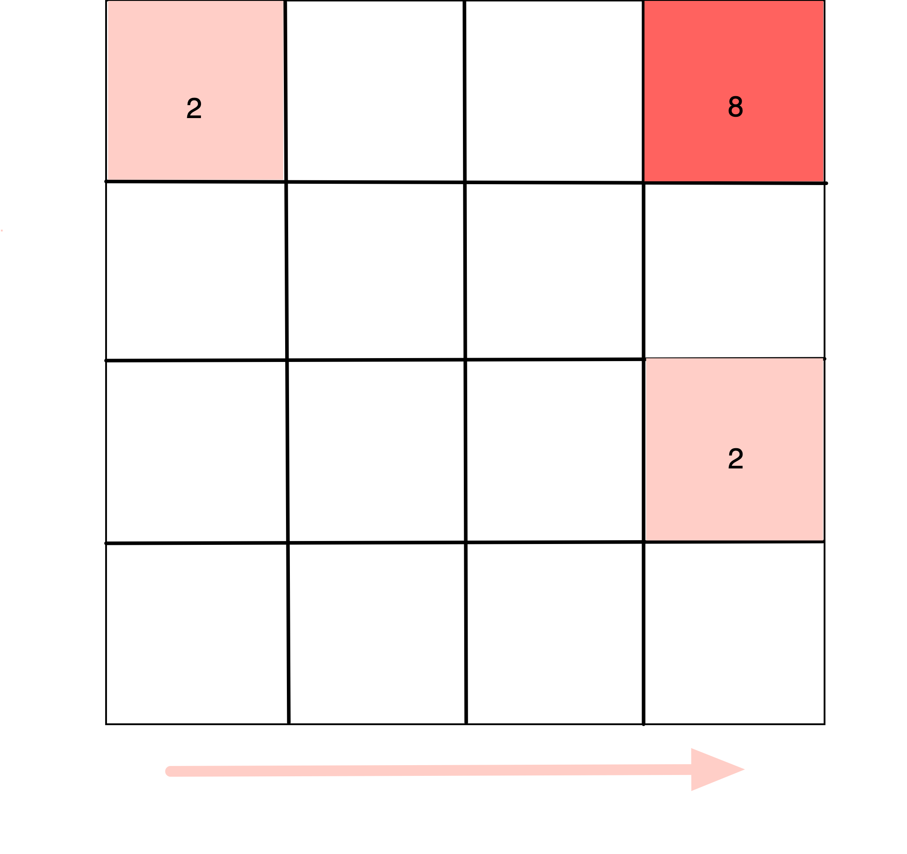
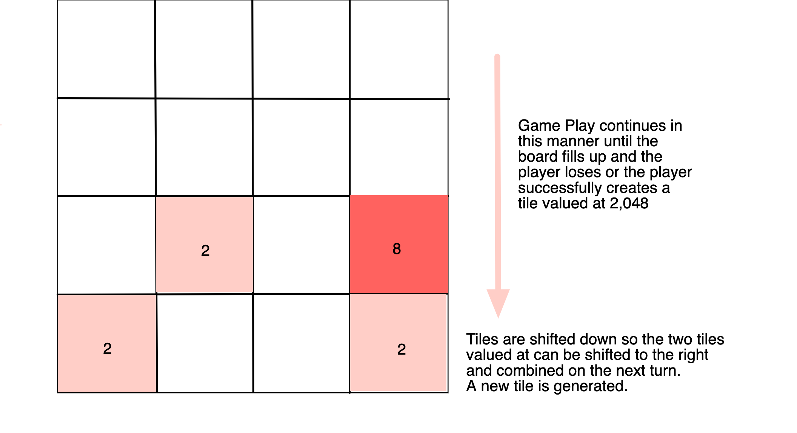

# 2048
## Overview: 
### This project is my version of the game 2048. I am building this game for my first project in my General Assembly Software Engineering course. I chose this game because the challenge of figuring out how the tiles move appealed to me. I felt that it was the perfect project to help me strengthen my javascript, HTML, amd CSS skills. 
## Game Rules: 
### 2048 is set up on a 4x4 grid. The player begins with 2 tiles that are valued at 2 or 4 placed randomly on the board. From there, the player uses the up, down, left, and right arrow keys to shift the tiles on the board. When the tiles are shifted, they go as far in the direction of the shift that they can. When two tiles with the same value collide, they combine and become the sum of the two values. When the tiles are shifted, new tiles valued at either 2 or four are generated. Game play continues as the board gets more crowded and tiles are combined to sum larger numbers with the goal of reaching a tile valued at 2,048. If the board becomes too crowded and there are no more shifts that will lead to tile combinations, the player loses. 
## Wireframes:
1.  Game play begins and two tiles are randomly generated.
2.  
3. 
4.  Tiles are shifted to the right to combine the two tiles valued at 4. A new tile is generated.
5. 
## User stories: 
### When the game begins I press an arrow key and shift the tiles in the direction of the arrow key that I pressed. Upon this shift, a new tiles is generated. I am either able to shift the tiles in a direction where some will combine values or no values are combined. More tiles continue to appear as I try to manage a fuller game board and tiles valued at higher numbers by shifting the board in the directions of the arrows keys. Game play continues as I shift tiles to try to combine them and reach a tile valued at 2,048 or until I lose when the board fills up and there are no more possible moves. 
## MVP Checklist: 
* Game must include numbered tiles that can be shifted using the arrow keys.
* Game must have the functionality to recognize when two tiles of the same value collide and must be summed to create a new tile.
* Game must randomly generate new tiles with the value of 2 or 4 upon each player move.
* Game must recognize when the player attains a tile valued at 2,048 and wins.
* Game must recognize when the board is full with no possible shifts and the player loses. 
## Stretch Goals: 
* Animated transitions as the tiles move. 
* Score board to track players progress.
* Color coded tiles for each of the different values that change colors when the value of the tile is changed.

